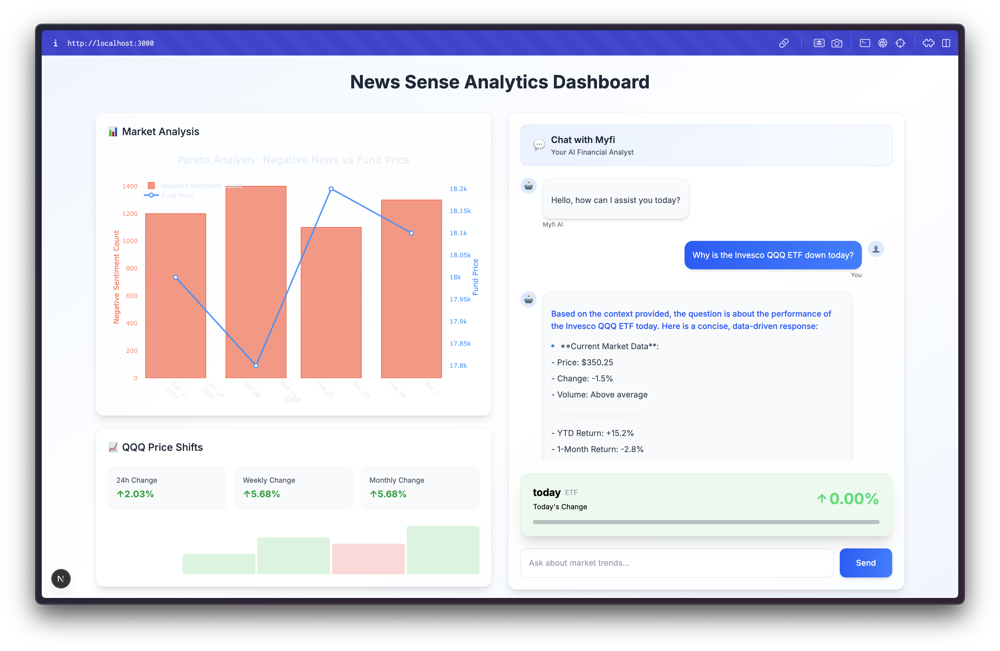

# Quantum Hackathon Project - PS1

A modern web application for natural language processing and information retrieval.

## Project Structure

```
.
├── app/              # Backend application code
├── frontend/         # Frontend application code
├── data/            # Data storage and processing
├── database/        # Database related files
├── notebooks/       # Jupyter notebooks for analysis
├── tests/           # Test files
└── venv/            # Python virtual environment
```

## Demo

[](docs/videos/demo-video.mp4)


## Prerequisites

- Python 3.8 or higher
- pip (Python package manager)
- Virtual environment (recommended)

## Setup Instructions

1. Clone the repository:

```bash
git clone <repository-url>
cd nhce-2
```

2. Create and activate a virtual environment:

```bash
python -m venv venv
source venv/bin/activate  # On Windows use: venv\Scripts\activate
```

3. Install dependencies:

```bash
pip install -r requirements.txt
```

4. Set up environment variables:

   - Copy `.env.example` to `.env` (if not already present)
   - Update the environment variables in `.env` with your configuration

5. Initialize the database:

```bash
# Add database initialization commands here
```

6. Start the backend server:

```bash
cd app
uvicorn main:app --reload
```

7. Start the frontend development server:

```bash
cd frontend
# Add frontend start command here
npm install

npm run dev
```

## Dependencies

The project uses the following main dependencies:

- FastAPI for backend API
- OpenAI for language processing
- FAISS for vector search
- Spacy for NLP
- Transformers for language models
- Pinecone for vector database
- LangChain for LLM applications

## Development

- Backend API runs on `http://localhost:8000`
- API documentation available at `http://localhost:8000/docs`
- Frontend development server runs on `http://localhost:3000`

## Testing

Run tests using:

```bash
pytest tests/
```

## Contributing

1. Fork the repository
2. Create your feature branch (`git checkout -b feature/AmazingFeature`)
3. Commit your changes (`git commit -m 'Add some AmazingFeature'`)
4. Push to the branch (`git push origin feature/AmazingFeature`)
5. Open a Pull Request

## License

This project is licensed under the MIT License - see the LICENSE file for details.
